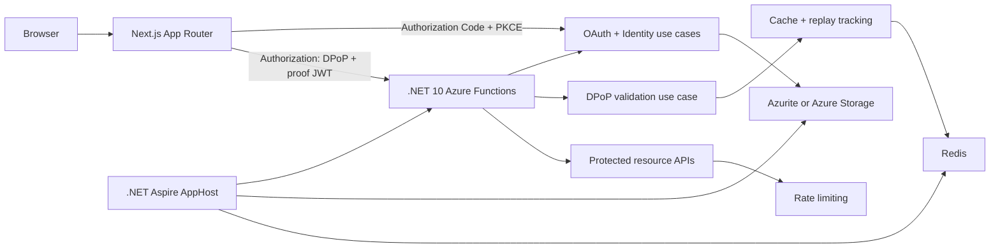
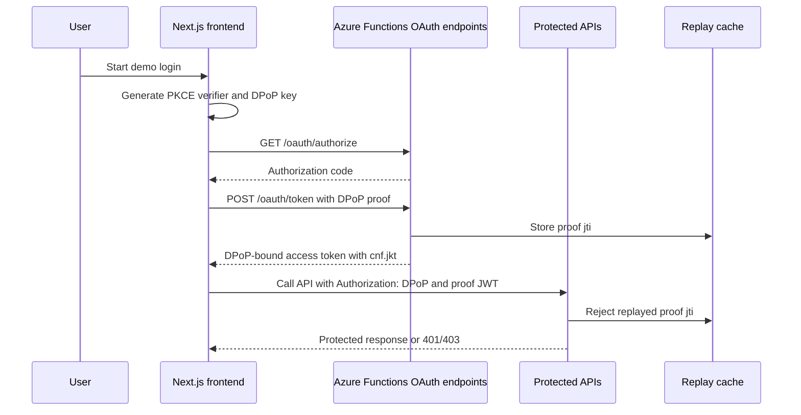

# DPoP OAuth 2.0 Portfolio

Self-contained portfolio project demonstrating OAuth 2.0 Demonstrating Proof of Possession (DPoP) with a .NET 10 Azure Functions backend, .NET Aspire orchestration, and a Next.js frontend.

## Repo Layout

- `docs/` - architecture, implementation, and portfolio notes.
- `src/backend/DpopPortfolio.sln` - backend-only solution with Functions, Aspire AppHost, ServiceDefaults, and tests.
- `src/backend/DpopPortfolio.AppHost` - Aspire orchestration for Functions, Azurite, and Redis.
- `src/backend/DpopPortfolio.Functions` - .NET 10 Azure Functions isolated-worker backend.
- `src/backend/DpopPortfolio.Functions.Tests` - backend xUnit tests.
- `src/backend/DpopPortfolio.ServiceDefaults` - Aspire service defaults for telemetry, resilience, and service discovery.
- `src/frontend/` - Next.js App Router frontend.

## Architecture



## DPoP Flow



## Concepts To Showcase

- OAuth 2.0 Authorization Code + PKCE.
- DPoP-bound access and refresh tokens.
- Authentication and authorization.
- Replay protection with cache-backed `jti` tracking.
- Rate limiting for token and API endpoints.
- Public data caching.
- Aspire dashboard observability and local orchestration.
- Audit logging and portfolio-focused security documentation.

## Local Tooling

Installed on this machine:

- .NET SDK `10.0.301`
- Node.js `v24.18.0`
- npm `11.16.0`

Still needed for full local runtime execution:

- Azure Functions Core Tools v4.
- Docker Desktop or compatible Docker runtime for Aspire containers or `docker compose`.
- Azurite for local Azure Storage emulation.
- Redis or compatible cache for distributed replay/rate-limit demonstrations.

## Getting Started

Backend build and tests:

```powershell
dotnet build .\src\backend\DpopPortfolio.sln
dotnet test .\src\backend\DpopPortfolio.sln
```

Run the Aspire AppHost:

```powershell
dotnet run --project .\src\backend\DpopPortfolio.AppHost\DpopPortfolio.AppHost.csproj
```

Frontend build:

```powershell
cd .\src\frontend
npm run build
```

Azure Functions direct runtime execution still requires Azure Functions Core Tools:

```powershell
cd .\src\backend\DpopPortfolio.Functions
func start
```

Local Azurite and Redis infrastructure can also be started without Aspire:

```powershell
docker compose up -d
```

See [docs/local-development.md](docs/local-development.md) for local configuration, health checks, and infrastructure notes.
